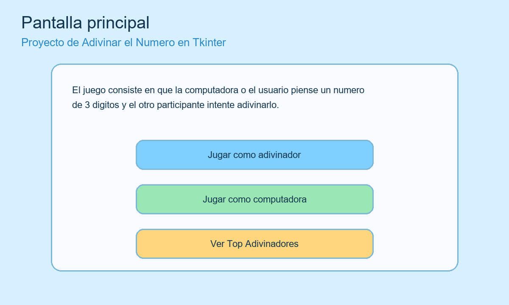
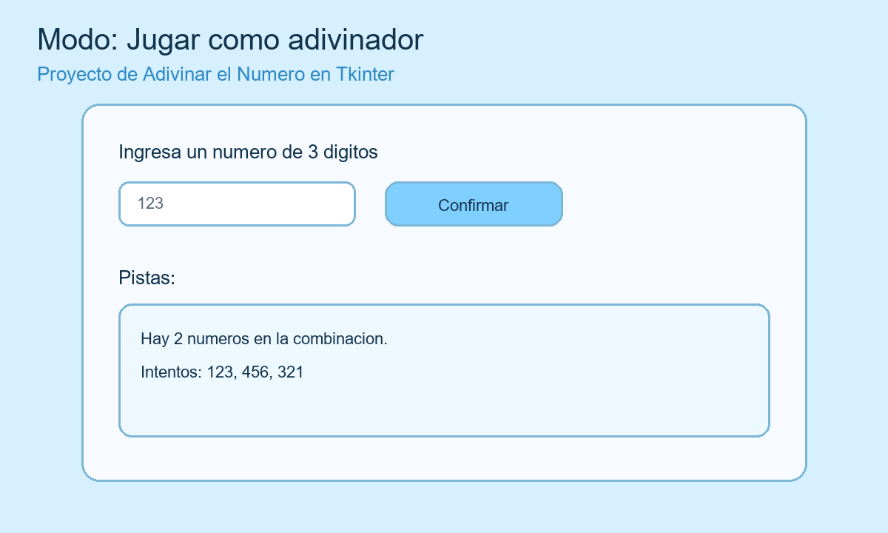
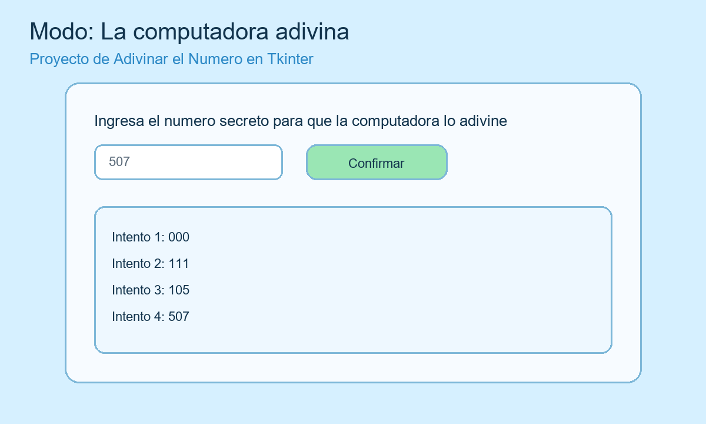
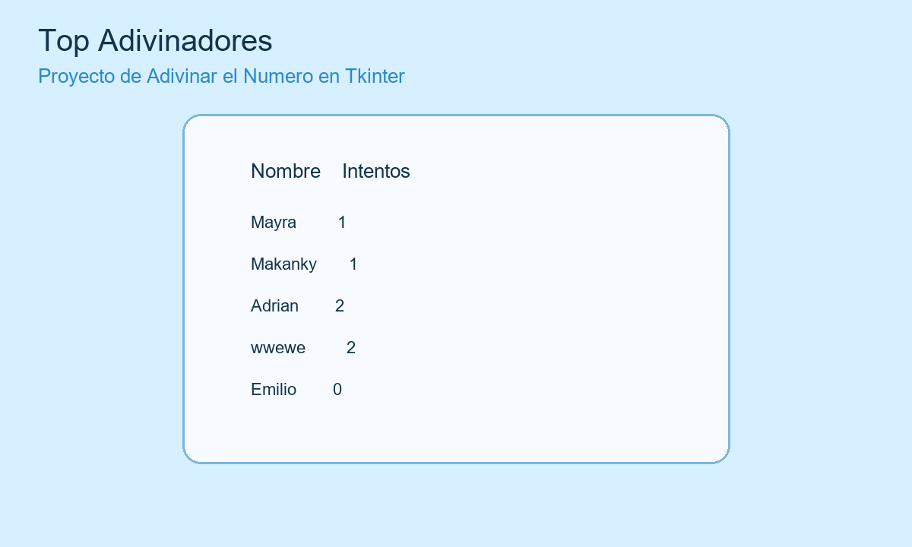

# Proyecto De Programacion 1: Adivina El Numero

Este proyecto es un juego hecho con `Tkinter` en Python. El objetivo es adivinar una combinacion de 3 digitos, o dejar que la computadora adivine el numero que piensa el usuario.

## Que hace el programa

El juego tiene 3 opciones principales:

1. `Jugar como adivinador`
   El usuario intenta descubrir una combinacion secreta de 3 digitos.

2. `Jugar como computadora`
   El usuario escribe un numero y la computadora intenta adivinarlo mostrando sus intentos.

3. `Ver Top Adivinadores`
   Muestra los resultados guardados en el archivo `alo.csv`.

## Estructura del codigo

### `main.py`

Este archivo contiene la interfaz principal del programa.

Se encarga de:

- Crear la ventana principal.
- Mostrar el titulo y la descripcion del juego.
- Crear los botones principales.
- Pedir el nombre del jugador cuando gana.
- Guardar resultados en `alo.csv`.
- Mostrar la tabla de mejores intentos.
- Llamar a las funciones del archivo `Funciones.py`.

### `Funciones.py`

Este archivo contiene la logica principal del juego.

Se encarga de:

- Calcular cuantas coincidencias hay entre dos numeros.
- Generar todas las combinaciones posibles de `000` a `999`.
- Crear la ventana del modo adivinador.
- Crear la ventana del modo computadora.
- Manejar las pistas y el historial de intentos.

## Explicacion de las funciones mas importantes

### `calcular_pista(combinacion_a, combinacion_b)`

Cuenta cuantos digitos de un intento aparecen dentro de la combinacion secreta.

Ejemplo:

- Si la combinacion secreta es `123`
- Y el usuario escribe `132`
- La pista sera `3`, porque los tres numeros estan presentes.

### `generar_jugadas_posibles()`

Genera una lista con todas las combinaciones desde `000` hasta `999`.

La computadora usa esta lista para ir descartando posibilidades hasta encontrar el numero correcto.

### `mostrar_mensajeAdivinador(...)`

Abre la ventana donde el usuario trata de adivinar la combinacion.

Esta funcion:

- Valida que el numero tenga 3 digitos.
- Guarda los intentos del jugador.
- Muestra cuantas coincidencias tiene cada intento.
- Guarda el resultado cuando el jugador gana.

### `mostrar_mensajeComputadora(...)`

Abre la ventana donde la computadora intenta adivinar el numero del usuario.

Esta funcion:

- Recibe el numero secreto del usuario.
- Genera las jugadas posibles.
- Prueba una combinacion.
- Calcula cuantas coincidencias tiene.
- Filtra las jugadas que ya no sirven.
- Repite el proceso hasta acertar.

### `mostrar_Top_adivinadores()`

Lee el archivo `alo.csv` y muestra los nombres con sus intentos guardados.

## Flujo general del programa

1. Se abre la ventana principal.
2. El usuario elige un modo de juego.
3. El programa abre una ventana secundaria.
4. Se ejecuta la logica del modo elegido.
5. Si el usuario gana, se guarda su nombre y la cantidad de intentos.
6. Los resultados pueden verse despues en el top de adivinadores.

## Imagenes del programa

### Pantalla principal

En esta ventana aparecen los 3 botones principales del proyecto.

### Funcion `mostrar_mensajeAdivinador`

Aqui el usuario escribe un numero de 3 digitos y recibe pistas sobre cuantas coincidencias tiene.

### Funcion `mostrar_mensajeComputadora`

Aqui el usuario escribe un numero secreto y la computadora muestra sus intentos hasta adivinarlo.

### Funcion `mostrar_Top_adivinadores`

Aqui se muestran los resultados guardados en `alo.csv`.

## Archivos importantes

- [main.py](main.py)
- [Funciones.py](Funciones.py)
- [alo.csv](alo.csv)

## Tecnologias usadas

- Python
- Tkinter
- Pandas

## Nota

Las imagenes del README son ilustrativas y representan como funciona la interfaz del proyecto.
